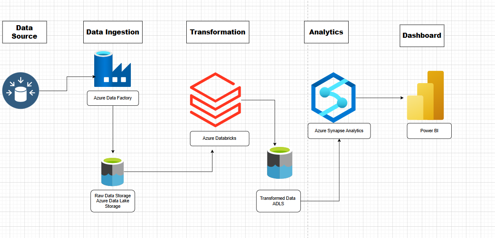

# 🏅 Azure End-to-End Data Engineering Pipeline: Tokyo Olympics

## 📌 Project Overview

This project builds a comprehensive data engineering pipeline on **Microsoft Azure** to analyze the **Tokyo Olympics dataset** (sourced from Kaggle). The goal is to ingest, transform, and visualize data regarding athletes, coaches, teams, medals, and gender entries to derive actionable insights.

## 🏗️ Architecture & Workflow

The pipeline follows a modern Data Lakehouse architecture:

1.  **Data Ingestion:** Used **Azure Data Factory (ADF)** to ingest raw data from external sources (Kaggle/GitHub) into **Azure Data Lake Gen2** (Raw Layer).
2.  **Data Transformation:** Leveraged **Azure Databricks** (PySpark) to mount the Data Lake, clean the data, perform transformations (renaming columns, changing types), and load the refined data back into the Data Lake (Transformed Layer).
3.  **Data Loading:** Connected **Azure Synapse Analytics** to the transformed data for high-performance querying.
4.  **Visualization:** Built an interactive dashboard in **Power BI** to visualize key metrics like medals, gender distribution, and country performance.

## 📂 Dataset

The analysis is based on five key datasets:

- **Athletes:** Details about participating athletes.
- **Coaches:** Information on coaches across different countries.
- **Teams:** Team details and disciplines.
- **Medals:** Medal counts (Gold, Silver, Bronze) by country.
- **Entries Gender:** Gender distribution statistics by discipline.

## 🛠️ Tech Stack

- **Cloud Provider:** Microsoft Azure
- **ETL Orchestration:** Azure Data Factory
- **Processing:** Azure Databricks (PySpark)
- **Storage:** Azure Data Lake Gen2 (ADLS)
- **Warehousing:** Azure Synapse Analytics
- **Visualization:** Power BI
